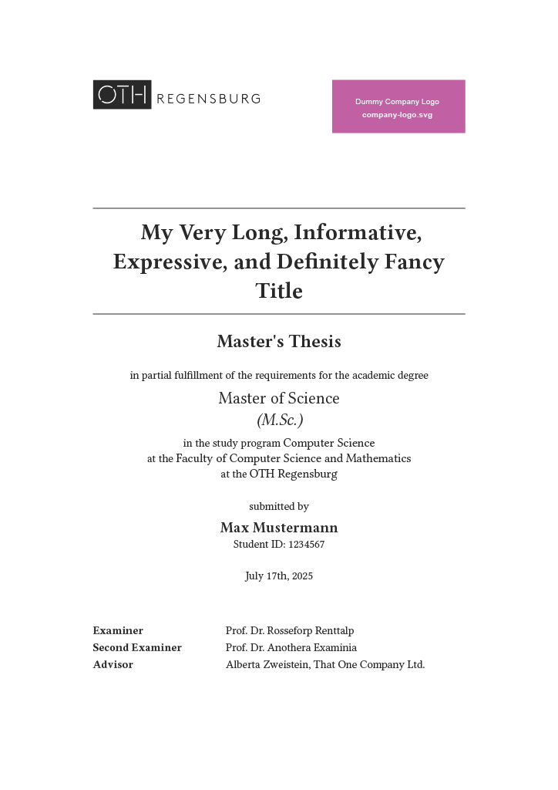

# OTH Regensburg Thesis Template

This template is for OTH Regensburg students writing their Bachelor's or Master's thesis.

> This repository is a fork of the [HPI Thesis Template](https://typst.app/universe/package/cleanified-hpi-thesis/) ([Source](https://github.com/felixhoffmnn/hpi-thesis-template)), adapted for OTH Regensburg.

## Disclaimer

- This template is not official.
- Official university guidelines may differ from the ones used in this template.

## Example Title Page



## Features

- Support for both English and German language.
- Suitable for both Bachelor's and Master's theses.
- Customizable appearance (e.g. translated title, company logo, accent color).
- Highly customizable metadata: title, optional translated title, optional short title, student name, student ID, date, study program, degree, one or multiple advisors, etc.
- Optional pre-body content between table of contents and main body (so called front-matter, e.g. glossary or lists of figures/tables).
- Automatically adds OTH-style Declaration of Authorship at the end of the document.
- Configurable typography and layout options (for-print, toc-depth, show-header).

## Getting Started

```bash
typst init @preview/oth-regensburg-thesis
```

For for local development follow [these steps.](https://github.com/typst/packages/?tab=readme-ov-file#local-packages)

## Configuration

An example configuration is located in [`example/`](./example/main.typ).

```typst
#import "@preview/oth-regensburg-thesis:0.1.0": *

#show: project.with(
  title: "My Very Long, Informative, Expressive, and Definitely Fancy Title",
  // translation: "Eine adäquate Übersetzung meines Titels",
  // short-title: "My Very Short but still Informative Title", // Optional, currently unused
  name: "Max Mustermann",
  student-id: "1234567",
  date: "July 17th, 2025",
  study-program: "Computer Science",
  degree: "Master",
  // field: "Engineering",  // "Science" (B.Sc./M.Sc.) (default), "Engineering" (B.Eng./M.Eng.), "Arts" (B.A./M.A.)
  professor: "Prof. Dr. Rosseforp Renttalp",
  second-professor: "Prof. Dr. Anothera Examinia",
  advisors: (
    "This person",  // Even for a single advisor, Typst requires the subsequent comma!
    // "Someone Else"  // Add as many advisors as you like
  ),
  abstract: abstract,
  abstract-de: abstract-de,
  acknowledgements: acknowledgements,
  // pre-body: [  // Optional content to be placed between the table of contents and the main body
  //   #glossary()
  // ],
  bibliography: bibliography("references.bib"),
  // lang: "de",
  // typography: (font: "STIX Two Text", body-text-size: 12pt),
  layout: (
    // for-print: true,
    // toc-depth: 2,
    show-header: true,
  ),
  appearance: (
    // accent-color: rgb("#164194"),
    company-logo: image("company-logo.svg", alt: "Logo of associated company or institution", width: 5cm),
    // university-logo-width: 5cm,
  ),
)

... your content ...
```
